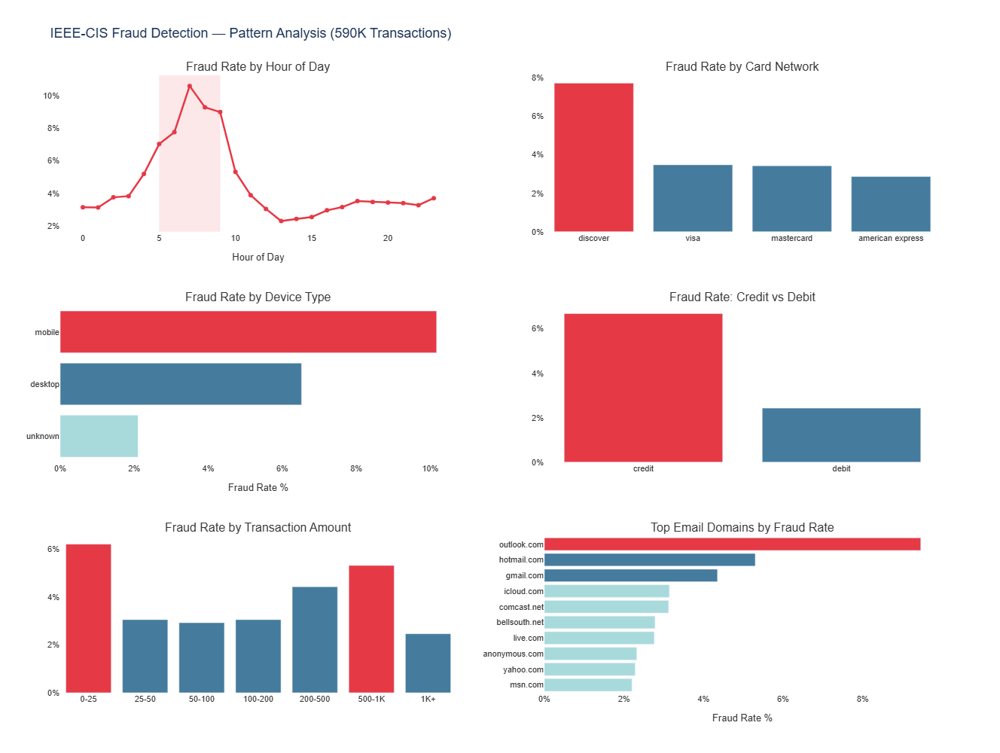
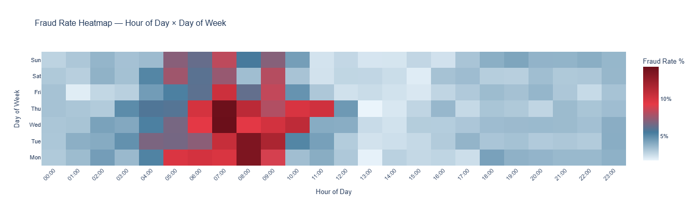
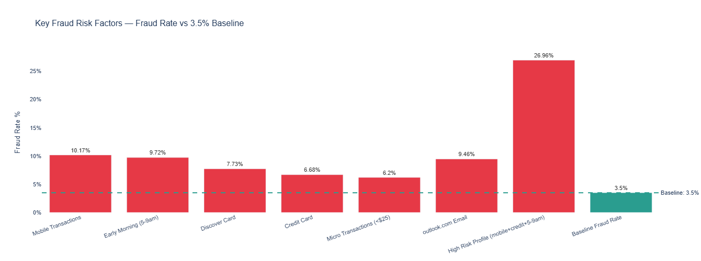

# Payment Fraud Pattern Analysis
### IEEE-CIS Transaction Dataset | 590K Transactions | Python · SQL · Plotly

---

## Overview
An end-to-end fraud analysis on 590,540 real-world payment transactions, 
identifying high-risk patterns across time windows, card types, devices, 
and transaction amounts. Mirrors real payment fraud monitoring workflows 
used at fintech companies like Razorpay and smallcase.

---

## Key Findings

| Risk Factor | Fraud Rate | vs Baseline |
|---|---|---|
| High Risk Profile (mobile + credit + 5-9am) | 26.96% | **7.9x** |
| Mobile Transactions | 10.17% | 2.9x |
| Early Morning Hours (5-9am) | 9.72% | 2.8x |
| outlook.com Email Domain | 9.46% | 2.7x |
| Discover Card | 7.73% | 2.2x |
| Credit Cards | 6.68% | 1.9x |
| Micro Transactions (<$25) | 6.20% | 1.8x |
| **Baseline Fraud Rate** | **3.50%** | 1x |

---

## Visualizations

### Fraud Pattern Analysis — 6 Dimensions


### Fraud Rate Heatmap — Hour × Day of Week


### Key Risk Factors vs Baseline


---

## Analytical Approach

**1. Data Preparation**
- Merged transaction (590K rows) and identity (144K rows) tables on TransactionID
- Feature engineered time variables (hour, day of week) from raw transaction timestamps
- Bucketed transaction amounts into business-meaningful segments

**2. Fraud Pattern Analysis**
- Analyzed fraud rates across 6 dimensions: time, card network, card type, 
  device, transaction amount, and email domain
- Identified early morning weekdays (5–9am Mon–Thu) as peak fraud window

**3. Statistical Anomaly Detection**
- Applied Z-score method to flag statistically abnormal transaction amounts
- 10,093 anomalies flagged (1.71% of transactions) with 5.33% fraud rate 
  vs 3.47% for normal transactions

**4. Multi-Factor Risk Profiling**
- Combined mobile device + credit card + early morning signals
- High risk segment: **26.96% fraud rate — 7.9x the 3.5% baseline**

**5. SQL Analysis**
- 10 business-focused queries including window functions, rolling averages, 
  Z-score anomaly flagging, and multi-table joins

---

## Repository Structure
```
├── Payment_Fraud_Analysis.ipynb  # Full analysis notebook
├── fraud_analysis_queries.sql    # 10 business SQL queries
├── README.md
└── images/                       # Chart exports
```

---

## Tools & Libraries
- **Python** — Pandas, NumPy, Plotly, SciPy
- **SQL** — Window functions, CTEs, rolling aggregations
- **Environment** — Google Colab

## Dataset
[IEEE-CIS Fraud Detection](https://www.kaggle.com/competitions/ieee-fraud-detection) 
— Kaggle Competition Dataset (590,540 transactions, 3.5% fraud rate)
